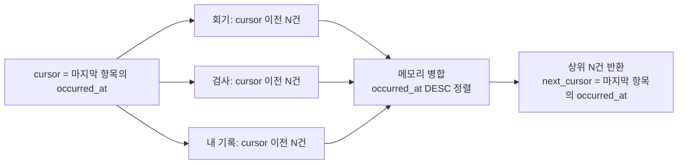
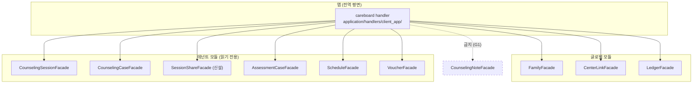
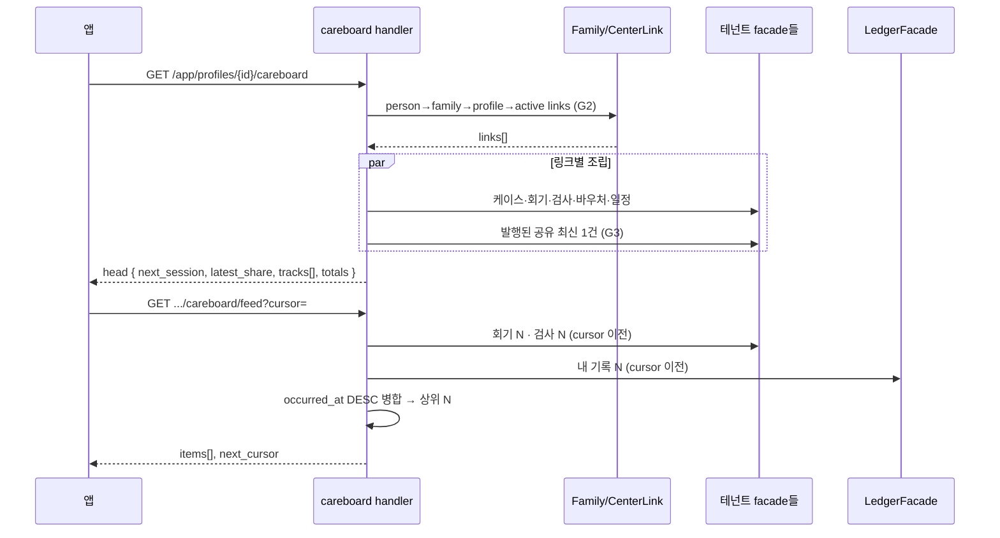

# 케어보드 아키텍처 v1

> 내담자앱(마인드스코프) 케어보드 탭 — 시안 A+B 조합안의 풀스택 설계
> 시안: [케어보드-메인-시안-v1.html](케어보드-메인-시안-v1.html) · 상위 기획: [내담자앱-설계.md](내담자앱-설계.md)
> 작성일 2026-08-21 · 상태: **설계 초안(미착수)**

---

## 0. 한 줄

케어보드는 **"우리 아이가 어디까지 왔고, 이번 주에 뭘 하면 되나"** 한 화면이다.
내담자 상세(직원용, 과거 이력 조회)와 축이 다르며, 세 출처 — **센터의 진행**·**선생님이 공유한 말**·**보호자 자신의 기록** — 을
한 시간축에 병합하되 **앱은 해석하지 않는다**(§7-2 판정 금지).

**기존 `활동` 탭을 대체한다.** 탭은 5개로 고정(홈·일정·기록·케어보드·마이).

| 현행 `활동` 탭 | 처리 |
|---|---|
| `활동 요약`(발달 지표 레이더·특성 키워드·추천 활동) | **폐기** — 전부 mock(`summaryData.ts`)이고, 발달 축 점수를 앱이 매기는 것 자체가 §7-2 판정에 해당 |
| `진행중인 활동`(CaseHub) | **흡수** — 케어보드 §2-C 진행 스트립으로 |

---

## 1. 화면 계약 (4블록)

```
┌ ① 다음 한 걸음 ─────────────┐   다음 회기 D-day + 장소 + 담당
├ ② 선생님이 함께 해보자고 한 것 ┤   최신 공유 1건 (없으면 빈 상태 문구)
├ ③ 지금 어디쯤 왔나 ──────────┤   케이스별 진행 스트립 (상담 N/M · 검사 상태)
└ ④ 여정 ────────────────────┘   회기·검사·내 기록 통합 피드 (무한 스크롤)
```

①②③ = **head**(한 번에 조립, 캐시 단위 하나) / ④ = **feed**(커서 페이지네이션).
엔드포인트를 이 경계로 가른다 — head는 매번 전량, feed는 페이지 단위라 수명이 다르다.

---

## 2. 데이터 출처 판정

| 블록 | 출처 | 현재 상태 | 게이트 |
|---|---|---|---|
| ① 다음 회기 | `ScheduleFacade` + `CounselingSessionFacade` | ✅ 있음 (`get_profile_progress`가 이미 계산) | G2 |
| ② 공유 카드 | **`counseling_session_shares` (신설)** | 🔶 **없음 — 이 설계의 유일한 신규 쓰기 축** | G1 우회 아님(§3-1) · G3 `published_at` |
| ③ 진행 스트립 | `CounselingCaseFacade`·`AssessmentTaskFacade`·`VoucherFacade` | ✅ 있음 | G2 · G3(`is_report_visible_to_guardian`) |
| ④-a 회기 점 | `CounselingSessionFacade` + `ScheduleFacade` | ✅ 있음 | G1(노트 원문 비노출) |
| ④-b 검사 점 | `AssessmentCaseFacade` | ✅ 있음 | G3 |
| ④-c 내 기록 점 | `LedgerFacade.list_entries` | ✅ 있음 (커서·limit 이미 지원) | 가족 스코프 · `private_memo` 필드 제거 |

**요지: ② 하나만 신설이고 나머지는 조립이다.** ②가 없으면 케어보드는 숫자와 날짜만 남아 다시 내담자 상세처럼 읽힌다.

---

## 3. 서버

### 3-1. 신설 — `counseling_session_shares` (테넌트 평면)

**위치**: `apps/api/app/modules/counseling/counseling_session_share/`
(형제 `counseling_note`와 같은 구조 — `models.py`·`repository.py`·`schemas.py`·`router.py`·`services/`·`handlers/`·`events.py`)

```python
class CounselingSessionShare(BaseModel):
    __tablename__ = "counseling_session_shares"

    center_id: Mapped[str] = mapped_column(String(36), nullable=False, index=True)
    counseling_session_id: Mapped[str] = mapped_column(
        String(36), nullable=False, index=True,
        info={"reference_table_name": "counseling_sessions"},
    )
    client_id: Mapped[str] = mapped_column(
        String(36), nullable=False, index=True,
        info={"reference_table_name": "clients"},
    )
    # 보호자가 읽을 글 — 임상 원문과 별개로 작성된다
    body: Mapped[str] = mapped_column(String(500), nullable=False)
    # 집에서 해볼 것 (선택) — 시안 ② 카드의 굵은 제목 줄
    practice_title: Mapped[str | None] = mapped_column(String(80), nullable=True)
    # 발행 전 = 초안. NULL이면 앱에 보이지 않는다 (G3)
    published_at: Mapped[datetime | None] = mapped_column(DateTime, nullable=True, index=True)
    author_id: Mapped[str] = mapped_column(
        String(36), nullable=False, index=True,
        info={"reference_table_name": "members"},
    )

    __table_args__ = (
        Index("uq_session_share_session_client", "counseling_session_id", "client_id",
              unique=True, postgresql_where=text("deleted_at IS NULL")),
        Index("idx_share_client_published", "client_id", "published_at"),
    )
```

#### 왜 `counseling_notes`에 `is_shared` 플래그를 달지 않는가 (핵심 결정)

| | 플래그 방식 | 별도 테이블 (채택) |
|---|---|---|
| 독자 | 임상용으로 쓴 문장이 그대로 부모에게 간다 | 부모를 향해 쓴 글만 부모에게 간다 |
| G1 보장 | 토글 하나에 의존 — 오조작 1회 = 임상 원문 유출 | **구조로 보장** — 노트 테이블은 앱 표면에서 아예 읽히지 않는다 |
| 회수 | `content` 안이라 이력 없음 | `published_at`을 비우면 회수, 감사 흔적 남음 |
| 문장 길이 | 임상 서술 그대로(수백 자·전문 용어) | 500자 상한 + 보호자 톤 |

**상담사 노동 증가 우려에 대한 완화**: 공유 작성 폼은 기존 노트의 `content.next_goal`·`content.homework`를
**초안으로 프리필**한다. 상담사는 다듬고 [공유] 1회. 백지 작성이 아니다.
(설계 원칙 "상담사 신규 노동 제로"의 취지 = *앱을 위한 별도 업무 축 신설 금지*이며, 기존 산출물을 재료로 쓰는 클릭 1회는 이에 저촉되지 않는다고 판정.)

### 3-2. 앱 read 표면 2개

`apps/api/app/modules/client_app/router.py`(`app_router`) + `apps/api/app/application/handlers/client_app/`

| Method | Path | Handler | 응답 |
|---|---|---|---|
| GET | `/app/profiles/{profile_id}/careboard` | `get_app_careboard_handler` | head — `next_session`·`latest_share`·`tracks[]`·`totals` |
| GET | `/app/profiles/{profile_id}/careboard/feed` | `list_app_careboard_feed_handler` | feed — `items[]`·`next_cursor` |

```python
# feed item — 3출처를 한 형태로 정규화한다 (출처별 스키마 분기 금지)
class AppCareboardFeedItem(BaseModel):
    kind: Literal["session", "assessment", "record"]
    occurred_at: datetime          # 정렬 축 (단일)
    title: str                     # "놀이치료 4회기" / "풀배터리 검사" / "내가 남긴 기록"
    subtitle: str | None           # "김선영 선생님" / "6종 완료" / mood 라벨
    center_name: str | None        # 내 기록이면 None
    status: str | None             # attended / report_ready / ...
    share: AppCareboardShareItem | None   # session이고 발행분이 있을 때만
    ref_id: str                    # 상세 이동용 (session_id / case_id / entry_id)
```

`kind`를 필드로 두고 형태를 하나로 고정하는 이유: 앱의 트레일이 **한 리스트 한 렌더러**여야 점 색·간격·정렬이 어긋나지 않는다.
출처별 배열 3개로 내려주면 병합·정렬이 앱으로 새고, 페이지 경계에서 순서가 깨진다.

### 3-3. 피드 병합 — k-way merge (커서 = `occurred_at`)

`ledger_entries`(전역 평면)와 `counseling_sessions`(테넌트 평면)는 **repo JOIN이 금지**돼 있다
(`.claude/rules/api/global-module.md` — 평면 횡단 JOIN 금지). SQL UNION도 불가.
따라서 handler에서 병합한다.



- 각 출처를 **N건씩만** 당기면 상위 N건의 정확성이 보장된다(정렬된 k개 리스트 병합의 표준 성질).
- 동시각 충돌은 `(occurred_at, kind, ref_id)` 복합 커서로 안정 정렬 — 같은 항목 중복·누락 방지.
- `LedgerFacade.list_entries(cursor=..., limit=...)`는 이미 이 모양이라 그대로 쓴다.

> **에스컬레이션 경로(지금은 하지 않음)**: 성능이 문제되면 직원용 `careboards`(append-only 이벤트 테이블,
> `docs/careboard/domain.md`)와 같은 물질화 피드로 승격. 지금 도입하지 않는 이유 = 전 도메인에 쓰기 훅을
> 심어야 하고, 앱 MVP 규모(가족당 수십~수백 행)에서 얻는 게 없다. **직원용 `careboards` 테이블과 이
> 앱 케어보드는 이름만 같고 다른 것** — 혼동 주의(전자는 센터 내부 협업 보드, 댓글·멘션 축).

### 3-4. 게이트 적용 지점 (한 곳에 모은다)

```python
async def get_app_careboard_handler(*, person_id, profile_id, uow):
    async with uow:
        family = await FamilyFacade(uow).ensure_family(person_id=person_id)
        await FamilyFacade(uow).get_profile(profile_id=profile_id, family_id=family.id)   # G2
        links = [l for l in await CenterLinkFacade(uow).list_links_by_family(
            family_id=family.id, alive_only=True) if l.profile_id == profile_id and l.status == "active"]
        ...
```

| 게이트 | 어디서 | 무엇을 |
|---|---|---|
| G2 | handler 진입부 | `person → family → profile → active links` 체인. 요청의 `profile_id`를 검증 없이 신뢰 금지 |
| G1 | 응답 조립 | `CounselingNoteFacade`를 **import하지 않는다**. 회기 항목에 붙는 텍스트는 `session_shares`뿐 |
| G3 | 조회 조건 | `published_at IS NOT NULL` · `is_report_visible_to_guardian` |
| 가족 스코프 | 피드 record 항목 | `private_memo`는 응답 스키마에서 **필드 자체를 제거**(null 아님) |

### 3-5. 이벤트 — 공유 발행 시 보호자 알림

기존 보호자 알림 생산자 6곳과 같은 패턴(`application/handlers/notification/`).

- 수신자 해석: `client_id → center_links(active) → family_id → FamilyMember 전원 → account_id`
- 인앱: "선생님이 남긴 이야기가 도착했어요" / 잠금화면: "새 소식이 있어요"(아이 이름·센터 성격 비노출)
- 신설 파일: `notify_session_share_published.py`

---

## 4. 웹 (상담사 표면)

**변경 1곳** — `apps/web/src/lib/components/counseling/InlineJournalEditor.svelte`

기존 4필드(상담 목표·진행 내용·다음 상담 내용·개인 메모) 아래에 **보호자 공유 블록**을 추가한다.

```
────────────────────────────────
보호자에게 공유            [ 공유 안 함 ▾ ]
┌──────────────────────────────┐
│ 집에서 해볼 것 (선택)          │
│ [순서 지키기 놀이           ]  │
│ 보호자가 읽을 내용             │
│ [다음 상담 내용에서 가져온 초안]│  ← next_goal / homework 프리필
│                     0/500     │
└──────────────────────────────┘
ⓘ 여기 쓴 내용만 보호자 앱에 보여요. 위 상담일지는 보이지 않아요.
```

- 기본값 **공유 안 함**. 발행은 명시 행동 1회.
- 발행 후 수정 = 새 내용으로 갱신(앱에도 갱신본), 회수 = `published_at` 비움.
- 신규 API: `PUT /centers/{center_id}/counseling-sessions/{session_id}/share` (upsert + publish/unpublish)
- 권한: 주담당만 쓰기(부담당은 열람) — 기존 `my_role` 게이팅과 정합.

---

## 5. 앱 (mobile-client)

```
apps/mobile-client/
├─ app/(main)/(tabs)/
│   ├─ careboard.tsx                 ← activity.tsx 대체 (탭 등록도 교체)
│   └─ _components/careboard/
│       ├─ NextStepHero.tsx          ① 다음 한 걸음
│       ├─ SharedNoteCard.tsx        ② 선생님이 공유한 것 (+ 빈 상태)
│       ├─ TrackStrip.tsx            ③ 진행 스트립 1행 (상담/검사 공용)
│       ├─ JourneyTrail.tsx          ④ 트레일 컨테이너
│       └─ TrailItem.tsx             ④ 항목 1개 (kind별 점 색만 분기)
└─ src/features/careboard/
    ├─ api.ts        getCareboard(profileId) / getCareboardFeed(profileId, cursor)
    ├─ types.ts      CareboardHead · CareboardFeedItem · CareboardTrack
    ├─ hooks.ts      useCareboard() · useCareboardFeed()  ← useInfiniteQuery
    └─ index.ts
```

- 쿼리 키: `['careboard', profileId]` / `['careboard-feed', profileId]`
- `_components/garden/*`(PlantPot·JourneyTrail·AssessmentStepper), `_components/activity/*`,
  `_components/hub/CaseHub.tsx` → **삭제 또는 흡수**. 특히 `summaryData.ts`(mock 발달 지표)는 삭제.
- 아이 선택은 기존 `ProfileSwitchSheet` 재사용(프로필 2개 이상일 때만 노출).
- ⚠️ Expo Router colocation 누수 방지 — `_components/` 하위는 default export 금지 규칙 유지.

---

## 6. 의존 방향



- 케어보드 handler는 **루트 facade의 read 메서드만** 호출한다. facade→facade 호출·repo JOIN 금지.
- 테넌트 모듈에 앱 전용 write를 만들지 않는다. 신규 write는 `session_shares` 하나이며, 이는 **상담사 표면**의 것이다.

---

## 7. 요청 흐름



---

## 8. 단계

| Phase | 범위 | 산출 | 선행 |
|---|---|---|---|
| **0** | 화면 골격 | `careboard.tsx` + ①③④ (기존 progress·schedules·records API 조합, 클라 병합) | 없음 — **바로 시작 가능** |
| **1** | 공유 축 | `counseling_session_shares` 마이그레이션 + 웹 작성 표면 + ② 카드 + 알림 | Phase 0 |
| **2** | 서버 조립 | head/feed 엔드포인트 신설, 클라 병합 → 서버 병합 이관, 활동 탭 잔재 삭제 | Phase 1 |

Phase 0을 클라 병합으로 먼저 세우는 이유: **② 없이도 화면이 서는지**를 먼저 확인해야 하고,
그 답이 "선다"면 Phase 1의 우선순위가 내려가고 "안 선다"면 ②가 곧 이 기능의 존재 이유라는 게 증명된다.

---

## 9. 결정 기록

| # | 결정 | 근거 |
|---|---|---|
| D1 | 케어보드가 `활동` 탭을 대체 | 탭 5개 고정. 활동 요약은 전량 mock이고 발달 축 점수화 = §7-2 판정 |
| D2 | 공유는 노트 플래그가 아니라 **별도 테이블** | G1을 토글이 아니라 구조로 보장(§3-1 비교표) |
| D3 | head / feed **2 엔드포인트** | 수명이 다르다 — head는 전량·짧은 캐시, feed는 페이지·무한 스크롤 |
| D4 | feed item은 `kind` 필드로 **단일 형태** | 한 리스트 한 렌더러. 출처별 배열이면 병합이 앱으로 새고 페이지 경계에서 순서가 깨진다 |
| D5 | 병합은 **handler k-way merge** | 평면 횡단 JOIN 금지. 물질화 피드는 쓰기 파급이 커서 규모가 요구할 때만 |
| D6 | 발달 레이더 **미도입** | 실제 척도 없이 축 점수를 그리면 판정. 대체 = 검사 결과지(사람이 쓴 것) 링크 |
| D7 | AI 요약 카드 **초안에서 제외** | 상담일지를 재료로 한 요약은 G1 우회. 재료를 진행 내역·공유분·보호자 기록으로 한정하면 재검토 가능 |

### 기각한 대안

- **`careboards` 이벤트 테이블 재사용** — 직원 협업 보드(댓글·멘션 축)와 목적·독자·게이트가 전부 다르다. 이름 충돌만 있고 재사용 지점이 없다.
- **케어보드 전용 백엔드 모듈 신설** — 자기 소유 데이터가 `session_shares` 하나뿐이라 모듈을 세울 근거가 없다. 조립은 `handlers/client_app/`가 소유(기존 `get_profile_progress`와 동일 패턴).
- **회기별 공유를 회기 상세에만 두기** — 부모가 회기를 열어야 보이면 ②의 도달률이 0에 가깝다. 메인 상단 고정이 이 기능의 전달 경로다.

---

## 10. 미결

1. **③ 진행 스트립의 분모** — `total_sessions`가 비어 있는 케이스(회차 미정)에서 점을 몇 개 그릴지. 후보: 점 대신 "N회 진행"만 표기.
2. **다중 센터** — 링크가 2개 이상일 때 트랙·트레일에 센터 라벨을 어떻게 붙일지(합산 금지 — 시간축 병합 + 라벨).
3. **공유 알림의 빈도** — 매 회기 발행이면 주 1~2회 푸시. 묶음 발송 여부.
4. **C안(그때와 지금)의 편입 시점** — 기록이 쌓인 뒤 트레일 안의 서랍으로. 두 시점을 앱이 자동 선택하면 판정이 되므로 부모 선택 또는 자명한 규칙(첫 기록/최근 기록)만.
