# 프론트엔드 모델 구조 & 레이어 가이드

> 프론트엔드 아키텍처를 **실행 구조(허브-스포크)**와 **상태 레이어(3층)**로 나누어 설명한다.
> 각 구성 요소가 무엇을 하고, 왜 필요한지를 한눈에 파악할 수 있도록 구성했다.

---

## 1. 전체 구조 한눈에 보기

프론트엔드는 두 가지 축으로 구성된다.

| 축 | 핵심 질문 | 구성 |
|---|---|---|
| **실행 구조 (허브-스포크)** | "누가 누구를 사용하는가?" | 페이지(허브)가 훅·쿼리·서비스·VM(스포크)을 조립 |
| **상태 레이어 (3층)** | "상태가 어디에 사는가?" | 서버 상태 / 전역 UI / 로컬 상태 |

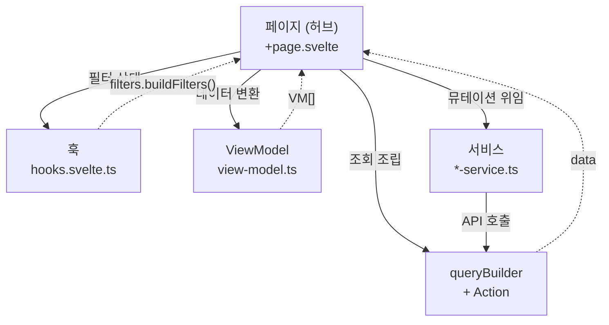

- **실선 →**: Page가 초기화하거나 호출한다
- **점선 →**: 결과 데이터가 Page로 돌아온다

**한 문장 요약**: 페이지는 **중심 허브**로서 훅·쿼리·서비스·VM 4개 스포크를 조립하고, 각 스포크는 독립적으로 한 가지 책임만 수행한다.

---

## 2. 실행 구조 (허브-스포크)

> **핵심**: 5개 역할이 "위에서 아래로 순차 호출"하는 구조가 **아니다**.
> Page가 **중심 허브**이고, 4개 도구(훅·쿼리·서비스·VM)가 **스포크**로 연결된다.

### 2.1 허브-스포크 구조도

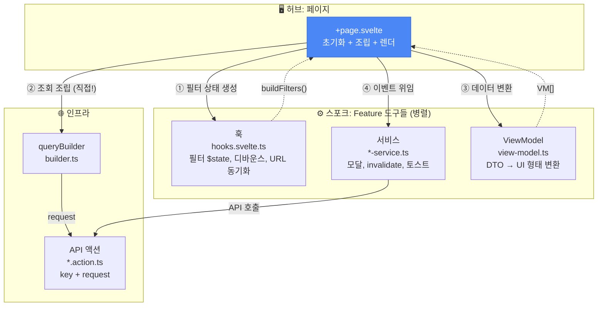

- **실선 →**: Page가 초기화하거나 호출한다
- **점선 →**: 결과 데이터가 Page로 돌아온다
- **②번 주목**: queryBuilder는 훅이나 서비스가 아닌 **Page가 직접** 호출한다

### 2.2 Page가 조립하는 것 (코드 매핑)

Page가 허브로서 실제 코드에서 무엇을 하는지 보여준다. (clients `+page.svelte` 기준)

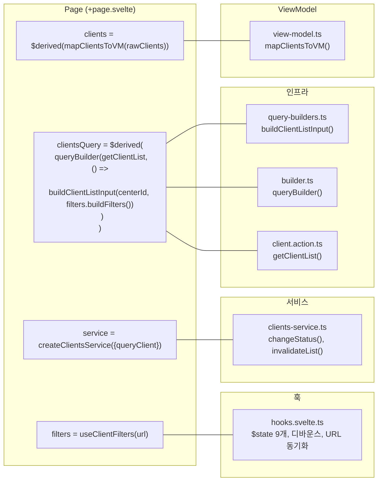

| Page 코드 | 사용하는 스포크 | 역할 |
|---|---|---|
| `useClientFilters(url)` | 훅 | 필터 상태 생성·관리 위임 |
| `createClientsService({queryClient})` | 서비스 | 뮤테이션 오케스트레이션 위임 |
| `queryBuilder(getClientList, ...)` | 인프라 (Builder + Action) | **Page가 직접** 조회 쿼리 조립 |
| `$derived(mapClientsToVM(...))` | ViewModel | 데이터 변환 위임 |

### 2.3 구성 요소별 역할 · 필요성

#### 허브: 페이지 (`routes/(protected)/**/+page.svelte`)

| 항목 | 내용 |
|---|---|
| **역할** | **중심 허브** — 4개 스포크(훅·쿼리·서비스·VM)를 초기화하고 조립 + 렌더 + 이벤트 연결 |
| **왜 필요한가** | 비즈니스 로직이 페이지에 쌓이면 재사용·테스트가 불가능. 페이지는 "무엇을 조립하고 보여줄지"만 결정하는 **조립자(orchestrator)**로 유지한다. |
| **하는 일** | ① `useClientFilters()` 호출 (훅), ② `queryBuilder()` 직접 선언 (조회 조립), ③ `$derived(mapClientsToVM)` (VM 변환), ④ 이벤트에 서비스 메서드 연결 |
| **하지 않는 일** | API를 직접 `fetch`하지 않음, 비즈니스 분기 없음, 캐시 관리(`invalidate`) 없음 |
| **queryBuilder를 Page가 직접 호출하는 이유** | 훅은 "필터 상태"만 관리하고, 서비스는 "뮤테이션"만 담당. **조회 쿼리 조립**은 둘 다의 책임이 아니므로 Page가 `filters.buildFilters()` + `getClientList` + `queryBuilder`를 직접 연결한다. |

#### 스포크 A: 훅 (`features/{domain}/hooks.svelte.ts`)

| 항목 | 내용 |
|---|---|
| **역할** | 필터 상태 관리, 디바운스, URL ↔ 필터 동기화 |
| **왜 필요한가** | 검색어·페이지네이션·정렬을 한 곳에서 관리해야 URL 공유·뒤로가기가 동작한다. 페이지는 `useClientFilters()`만 호출하면 된다. |
| **생략 가능** | 상태가 단순하고 URL 동기화가 불필요한 도메인에서는 생략 |
| **사용 도구** | Svelte 5 Runes (`$state`, `$effect`), `goto()` |

#### 스포크 B: 서비스 (`features/{domain}/*-service.ts`)

| 항목 | 내용 |
|---|---|
| **역할** | 사용자 행동에 대한 **오케스트레이션**: 모달 열기 → API 호출 → `invalidateQueries` → 스낵바/토스트 |
| **왜 필요한가** | "삭제 버튼 → 확인 모달 → API → 캐시 갱신 → 성공 알림"이라는 흐름을 **한 메서드로 캡슐화**. 페이지는 `service.changeStatus()`만 호출하면 된다. |
| **입력** | deps: `{ queryClient }` (팩토리 패턴) |
| **centerId** | deps에 넣지 않고, 실행 시점에 `requireCenterId()`로 가져옴 (SSR 안전) |

#### 스포크 C: ViewModel (`features/{domain}/view-model.ts`)

| 항목 | 내용 |
|---|---|
| **역할** | API 응답(DTO) → UI에서 쓰기 좋은 형태로 변환 (라벨, 색상, 날짜 포맷, boolean 플래그 등) |
| **왜 필요한가** | API 스키마가 바뀌어도 VM 변환 함수 한 곳만 수정하면 **컴포넌트 변경이 최소화**된다. 같은 API라도 목록/상세 등 화면별로 다른 가공이 가능하다. |
| **변환 예시** | `role: "guardian"` → `isGuardian: true`, `status: "active"` → `status: "ACTIVE"`, `created_at: string` → `personCreatedAt: Date` |

#### 스포크 D: API 액션 (`hooks/actions/*.action.ts`)

| 항목 | 내용 |
|---|---|
| **역할** | `key` + `request(params)` 쌍으로 **HTTP 호출만** 수행 |
| **왜 필요한가** | 순수하게 엔드포인트/HTTP만 담당해서 TanStack Query의 `queryFn`/mutation과 결합 시 **캐시·재시도가 일관 적용**된다. 새 도메인을 추가해도 동일 패턴으로 스캐폴딩. |
| **형태** | `() => ({ key: ['actionName'], request: async (params) => ... })` |

### 2.4 구성 요소별 입출력 정리 (clients 기준)

| 구성 요소 | 입력 | 출력 | 누가 호출하나 |
|---|---|---|---|
| **페이지 (허브)** | URL, centerId | (렌더) | SvelteKit 라우터 |
| 훅 (스포크 A) | URL, pathname | `ClientFilters`, `buildFilters()` | Page가 초기화 |
| 서비스 (스포크 B) | deps: `{ queryClient }` | (부수효과: 모달, 토스트, invalidate) | Page가 이벤트에 연결 |
| ViewModel (스포크 C) | API 응답 `items[]` | `ClientCardVM[]` | Page가 `$derived`로 호출 |
| queryBuilder (인프라) | Action + 훅의 `buildFilters()` 결과 | 서버 상태 (TanStack Query) | **Page가 직접 조립** |
| API 액션 (인프라) | `ClientListInput` | `Promise<ApiResponse>` | queryBuilder 또는 서비스 |

---

## 3. 상태 레이어 (3층)

### 3.1 상태 계층도

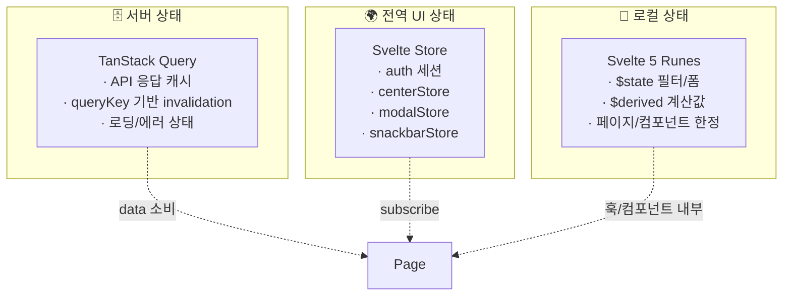

### 3.2 계층별 역할

| 계층 | 도구 | 무엇을 담는가 | 왜 이렇게 나눴는가 |
|---|---|---|---|
| **서버 상태** | TanStack Query | API 응답 캐시, `queryKey` 기반 invalidation, 로딩/에러 | 서버가 **진실의 원천**. 클라이언트는 캐시 + 필요 시 갱신만 → 중복 fetch·수동 동기화 방지 |
| **전역 UI** | Svelte Store (`writable`) | 세션(auth), 선택 센터(center), 모달, 스낵바 | 앱 전역에서 공유되는 UI 상태만 격리. 서버 데이터와 혼합하지 않아 명확 |
| **로컬** | Svelte 5 Runes | 필터 값, 폼 입력, 토글 | 해당 페이지/컴포넌트에서만 필요한 일시적 값. Store로 올리면 전역 오염 발생 |

**이 프로젝트에서 쓰는 구체적 이름**:

| 계층 | 구현체 | 위치 |
|---|---|---|
| 서버 상태 | `queryBuilder(getClientList, ...)` | `$lib/hooks/queries/builder.ts` |
| 전역 UI | `auth`, `centerStore`, `modalStore`, `snackbarStore` | `$lib/stores/` |
| 로컬 | `$state(searchQuery)`, `$derived(clients)` 등 | `hooks.svelte.ts`, `+page.svelte` |

---

## 4. 데이터/모델 3계층

### 4.1 데이터 변환 경로

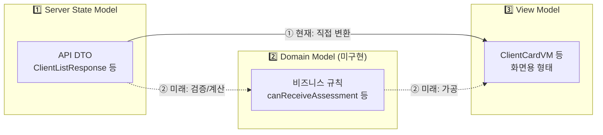

- **① 현재**: API DTO → ViewModel에서 바로 UI용 형태로 변환
- **② 미래**: Domain 규칙을 거쳐 검증·계산 후 ViewModel로 가공 (계획)

### 4.2 모델 계층별 설명

| 계층 | 현재 구현 | 역할 | 왜 나누는가 |
|---|---|---|---|
| **Server State Model** | `hooks/actions/*.action.ts` 반환 타입 | 백엔드 API 응답의 형상(DTO) | API 스펙과 클라이언트 타입을 일치시켜 **계약이 한 곳에만** 존재 |
| **Domain Model** | 미구현 (`lib/domain/` 계획) | UI와 무관한 비즈니스 규칙 | 규칙을 순수 함수로 두면 컴포넌트/서비스에 흩어진 `if`를 줄이고 테스트 용이 |
| **ViewModel** | `features/*/view-model.ts` | 특정 화면용 가공 데이터 | "표시"와 "도메인 규칙" 분리. API가 바뀌어도 VM 인터페이스만 유지하면 컴포넌트 불변 |

### 4.3 DTO → ViewModel 변환 예시 (clients)

| API 필드 (DTO) | 값 예시 | VM 필드 | 변환 결과 |
|---|---|---|---|
| `id` | `"uuid-123"` | `id` | `"uuid-123"` (그대로) |
| `role` | `"guardian"` | `isGuardian` | `true` (boolean 변환) |
| `status` | `"active"` | `status` | `"ACTIVE"` (대문자 정규화) |
| `birth_date` | `"2015-03-21"` | `birth` | `"2015-03-21"` (필드명 통일) |
| `gender` | `"male"` | `gender` | `"MALE"` (대문자 정규화) |
| `created_at` | `"2024-01-15T..."` | `personCreatedAt` | `Date` 객체 (타입 변환) |

---

## 5. Feature 모듈 디렉터리 구조

### 5.1 스캐폴드

```
src/lib/features/{domain}/{sub-domain}/
├── constants.ts        # 상수, 탭/필터 옵션, 모달 사이즈
├── filters.ts          # URL ↔ 필터 모델 ↔ API 파라미터 변환
├── query-builders.ts   # filters → API 입력 빌더
├── view-model.ts       # API 응답 → UI VM 변환
├── *-service.ts        # 모달, 토스트, invalidate 오케스트레이션
├── hooks.svelte.ts     # (옵션) Runes 기반 필터/상태 훅
└── index.ts            # 공개 API re-export
```

### 5.2 현재 도메인 구조

```
src/lib/features/
├── common/              # 공통 필터 유틸
├── assessment/          # 심리검사
│   ├── manage/          #   검사 관리
│   ├── status/          #   검사 현황
│   ├── status-detail/   #   검사 상세
│   ├── receive/         #   검사 접수
│   └── reservation/     #   검사 예약
├── counseling/          # 상담
│   └── status/          #   상담 현황
├── clients/             # 내담자 관리
├── members/             # 직원 관리
└── schedule/            # 일정
    ├── calendar/        #   캘린더
    ├── reservations/    #   예약 현황
    └── settings/        #   일정 설정
```

### 5.3 실제 파일 매핑 (clients 기준)

| 레이어 | 파일 |
|---|---|
| Page | `routes/(protected)/clients/+page.svelte` |
| Hooks | `lib/features/clients/hooks.svelte.ts` |
| Service | `lib/features/clients/clients-service.ts` |
| ViewModel | `lib/features/clients/view-model.ts` |
| Query Builder | `lib/features/clients/query-builders.ts` |
| Action | `lib/hooks/actions/client.action.ts` |
| Builder (공통) | `lib/hooks/queries/builder.ts` |

---

## 6. 사용자 동작별 흐름 도식화

> 사용자가 실제로 어떤 동작을 했을 때, 코드가 어떤 순서로 실행되는지를 시나리오별로 보여준다.

### 6.0 행동 유형별 경로 요약

사용자 행동은 크게 4가지 유형으로 나뉘며, 각각 거치는 레이어가 다르다.

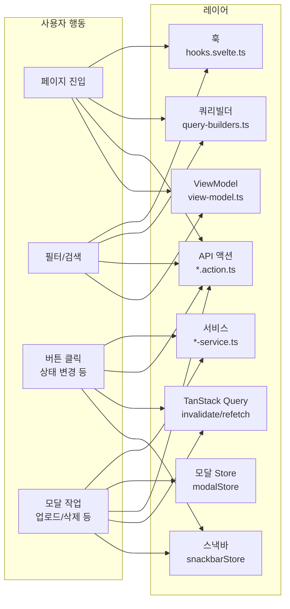

| 행동 유형 | Page가 사용하는 스포크 | 핵심 |
|---|---|---|
| **페이지 진입** | 훅 + queryBuilder(직접) + Action + VM | Page가 훅의 필터 출력 + Action을 queryBuilder로 조립 → VM 변환 → 렌더 |
| **필터/검색** | 훅(디바운스) → queryBuilder 자동 재실행 + VM | 훅의 상태 변경 → Page의 `$derived`가 queryKey 재계산 → 자동 refetch |
| **버튼 클릭** | 서비스 → Action → invalidate → 스낵바 | Page가 이벤트를 서비스에 위임, 서비스가 전체 흐름 오케스트레이션 |
| **모달 작업** | 서비스 → 모달 → Action → invalidate → 스낵바 | Page가 이벤트를 서비스에 위임, 서비스가 모달→API→갱신 캡슐화 |

---

### 6.1 목록 페이지 진입 (조회 흐름)

> 사용자가 `/clients` 페이지에 처음 들어왔을 때의 전체 흐름

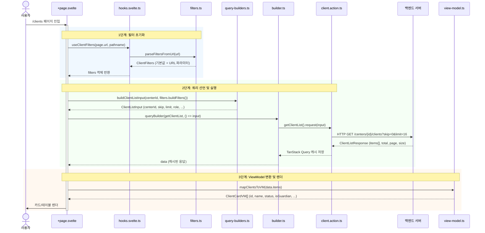

| 레이어 | 파일 | 이 흐름에서의 역할 |
|---|---|---|
| 페이지 | `routes/(protected)/clients/+page.svelte` | 훅·쿼리·VM 조합, 렌더 |
| 훅 | `features/clients/hooks.svelte.ts` | URL → 필터 $state 초기화 |
| 필터 | `features/clients/filters.ts` | URL 파라미터 파싱·기본값 적용 |
| 쿼리빌더 | `features/clients/query-builders.ts` | 필터 → API 파라미터(skip, limit 등) 변환 |
| 빌더 | `hooks/queries/builder.ts` | TanStack Query 생성 (캐시, 에러, 로딩) |
| Action | `hooks/actions/client.action.ts` | HTTP GET 호출 |
| ViewModel | `features/clients/view-model.ts` | DTO → ClientCardVM 변환 |

---

### 6.2 검색어 입력 (필터 변경 흐름)

> 사용자가 검색 input에 "김"을 입력했을 때, 디바운스를 거쳐 쿼리가 재실행되는 흐름

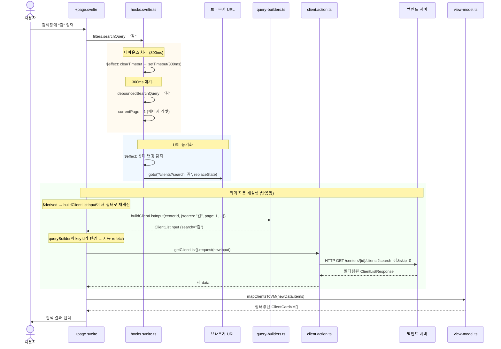

| 레이어 | 이 흐름에서의 역할 |
|---|---|
| 훅 | `$state` → `$effect`(디바운스 300ms) → `debouncedSearchQuery` 갱신 → `currentPage=1` 리셋 |
| 훅 | `$effect` → `goto()`로 URL 동기화 (replaceState, 히스토리 안 쌓임) |
| 쿼리빌더 | 새 필터로 `ClientListInput` 재생성 → queryKey 변경으로 TanStack Query 자동 재실행 |
| ViewModel | 새 응답을 `ClientCardVM[]`으로 재변환 |

---

### 6.3 내담자 상태 변경 (변경 흐름)

> 사용자가 내담자 카드에서 "비활성화" 버튼을 눌렀을 때

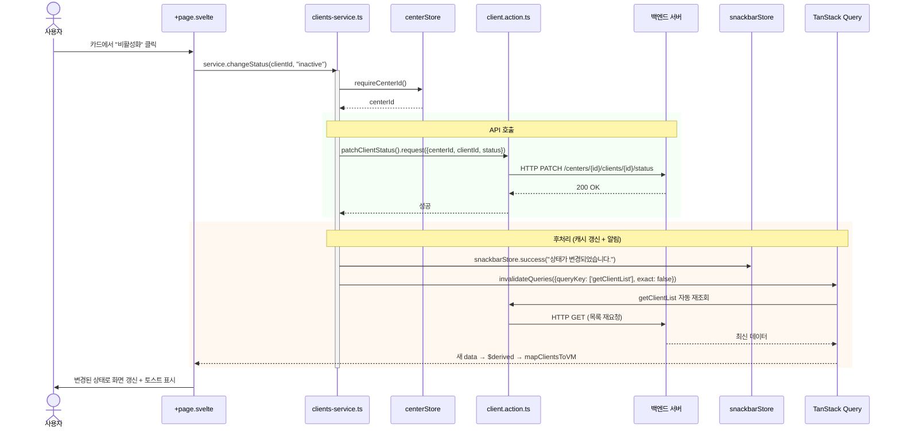

| 레이어 | 이 흐름에서의 역할 |
|---|---|
| 페이지 | 이벤트만 서비스에 전달: `onStatusChange={clientsService.changeStatus}` |
| 서비스 | `requireCenterId()` → API 호출 → `snackbar.success()` → `invalidateQueries()` **한 메서드에 캡슐화** |
| Action | `patchClientStatus()` — HTTP PATCH 호출 |
| TanStack Query | `invalidateQueries` → 해당 queryKey의 캐시 무효화 → 자동 재조회 |

---

### 6.4 상세 페이지 진입 (다중 쿼리 흐름)

> 사용자가 `/clients/[clientId]` 상세 페이지에 진입했을 때, 여러 쿼리가 동시에 실행되는 흐름

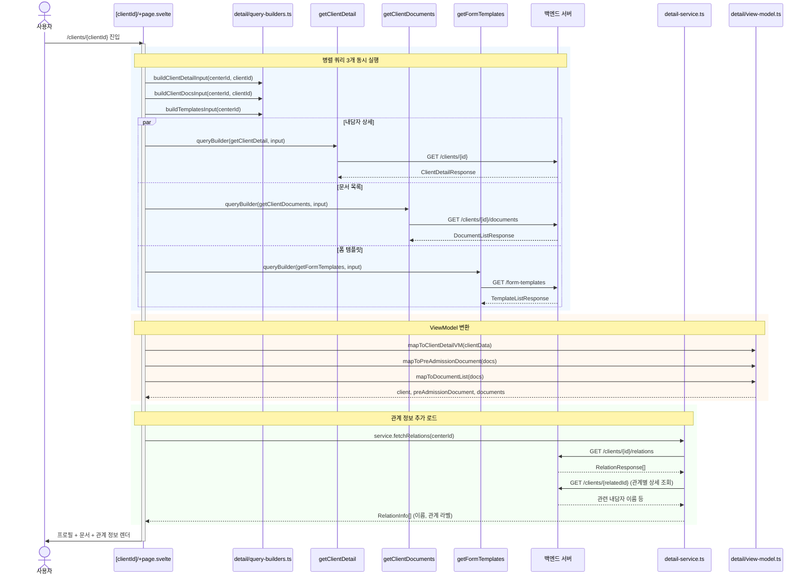

| 레이어 | 이 흐름에서의 역할 |
|---|---|
| 페이지 | `$derived`로 3개 queryBuilder 선언 → 병렬 실행, `$effect`로 관계 정보 로드 |
| 쿼리빌더 | 각 쿼리의 입력 생성 (clientId, centerId 기반) |
| Action | `getClientDetail`, `getClientDocuments`, `getFormTemplates` — 각각 독립 HTTP 호출 |
| ViewModel | 3종 DTO를 각각 UI용으로 변환 |
| 서비스 | 관계 정보 fetch + 보호자 이름 조합 |

---

### 6.5 문서 업로드 (모달 + API + 갱신 흐름)

> 사용자가 상세 페이지에서 "문서 업로드" 버튼을 클릭하고 파일을 선택해 업로드하는 전체 흐름

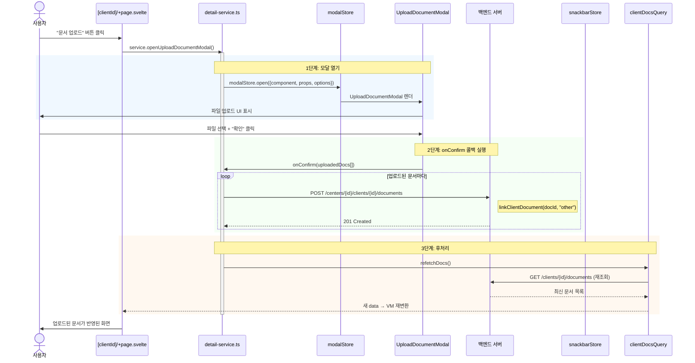

| 레이어 | 이 흐름에서의 역할 |
|---|---|
| 페이지 | 이벤트만 서비스에 전달: `onDocumentUpload={service.openUploadDocumentModal}` |
| 서비스 | 모달 열기 → `onConfirm` 콜백 정의 (API 호출 + refetch) |
| modalStore | 모달 컴포넌트 렌더 관리 (전역 UI 상태) |
| 모달 컴포넌트 | 파일 선택 UI → 사용자 확인 시 `onConfirm(files)` 호출 |
| API | `linkClientDocument()` — 문서와 내담자 연결 |
| Query | `refetchDocs()` → 문서 목록 재조회 → 화면 갱신 |

---

### 6.6 문서 삭제 (확인 모달 + 삭제 흐름)

> 사용자가 문서 삭제 버튼을 클릭하면, 확인 모달을 거쳐 삭제 후 화면이 갱신되는 흐름

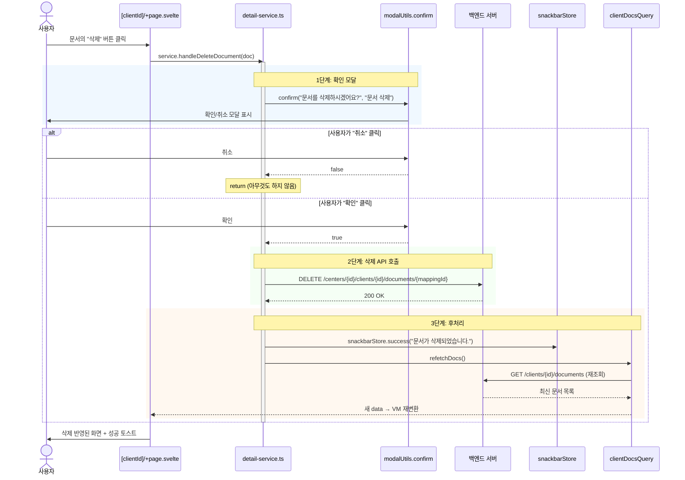

| 레이어 | 이 흐름에서의 역할 |
|---|---|
| 페이지 | 이벤트만 전달: `onDocumentDelete={service.handleDeleteDocument}` |
| 서비스 | `modalUtils.confirm()` → API 호출 → `snackbar.success()` → `refetchDocs()` **모두 한 메서드** |
| modalUtils | `confirm()` — Promise<boolean> 반환하는 확인 모달 유틸 |
| API | `unlinkClientDocumentMapping()` — 문서 연결 해제 |
| 스낵바 | 성공/실패 메시지 표시 |

---

### 6.7 사전기록지 온라인 요청 (복합 API 흐름)

> 사용자가 "사전기록지 요청" 버튼을 클릭하면, 템플릿 조회 → 모달 → 폼 인스턴스 생성·저장·제출이 연속으로 실행되는 흐름

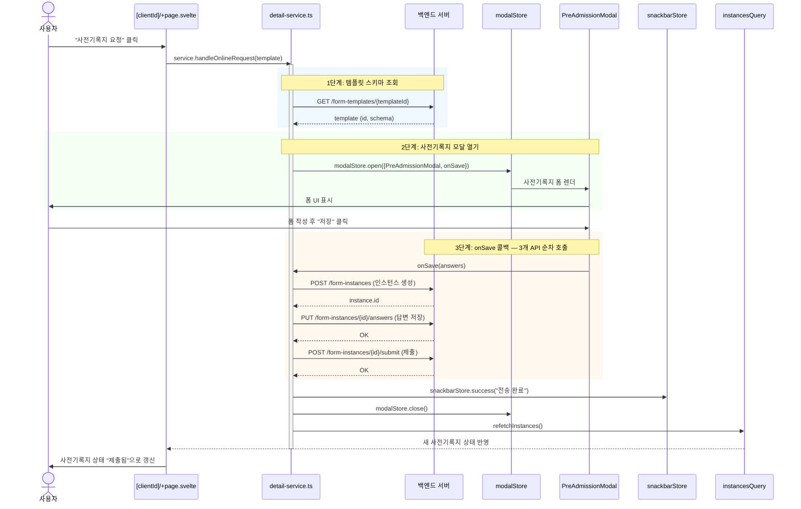

| 레이어 | 이 흐름에서의 역할 |
|---|---|
| 서비스 | 템플릿 조회 → 모달 열기 → onSave에서 **3개 API 순차 호출** → 토스트 → 모달 닫기 → refetch |
| modalStore | 모달 open/close 관리 |
| Action | `postLinkFormInstance`, `putSaveFormAnswers`, `postSubmitFormInstance` — 각각 독립 HTTP 호출 |
| Query | `refetchInstances()` → 사전기록지 상태 재조회 |

---

## 7. 설계 원칙 요약

### 왜 이렇게 나누는가

| 원칙 | 효과 |
|---|---|
| **페이지는 얇게** | 비즈니스 로직이 `+page.svelte`에 없으므로 재사용·테스트 가능 |
| **서비스가 오케스트레이션** | 모달→API→캐시갱신→토스트를 한 메서드로 묶어, 페이지는 의도만 전달 |
| **ViewModel로 API와 UI 분리** | 백엔드 DTO가 바뀌어도 VM 변환 함수 한 곳만 수정하면 컴포넌트 불변 |
| **Action 단일 패턴** | `key + request()` 쌍이라 새 도메인 추가 시 동일 스캐폴드 적용 |
| **상태 3층 분리** | 서버/전역/로컬을 혼합하지 않아 디버깅·변경 범위가 명확 |

### 변경 시 어디를 고치는가

| 변경 내용 | 수정 파일 | 영향 범위 |
|---|---|---|
| 필터 추가 / 정렬 변경 | `filters.ts`, `query-builders.ts` | 페이지 수정 불필요 |
| 표현 변경 (라벨, 색상) | `view-model.ts` | UI·서비스·API 불변 |
| API 계약 변경 (파라미터/응답) | `action.ts`, `query-builders.ts` | VM에서 흡수, 컴포넌트 불변 |
| 행동 흐름 변경 (모달 추가 등) | `*-service.ts` | 페이지는 호출만 |

---

## 8. 참고 파일

| 용도 | 경로 |
|---|---|
| Feature 모듈 아키텍처 (V4, 허브-스포크) | `apps/web/CLAUDE.md` |
| 쿼리/뮤테이션 빌더 | `apps/web/src/lib/hooks/queries/builder.ts` |
| Action 타입 정의 | `apps/web/src/lib/types/apiResponse.ts` |
| 3계층 모델·Domain·Intent 설계 | `docs/frontend-ai-architecture.md` |
| 아키텍처 상세 (V4) | `apps/web/docs/FRONTEND_ARCHITECTURE_V4.md` |
